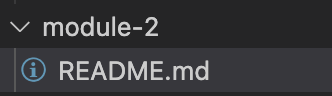

# Module 2

This is kind of module exported as namespace from main module

With image:

Additional docs:
- MD link: [Usage](./module-docs/USAGE.md)
- Plugin link: {@page ./module-docs/USAGE.md Usage}